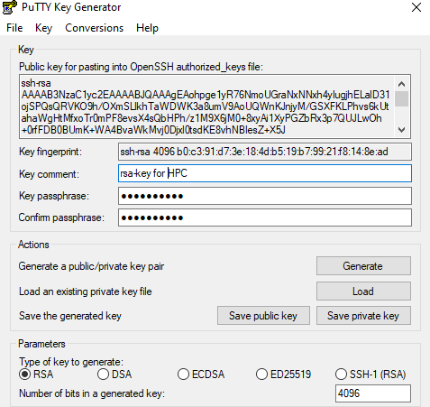
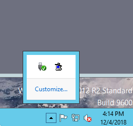
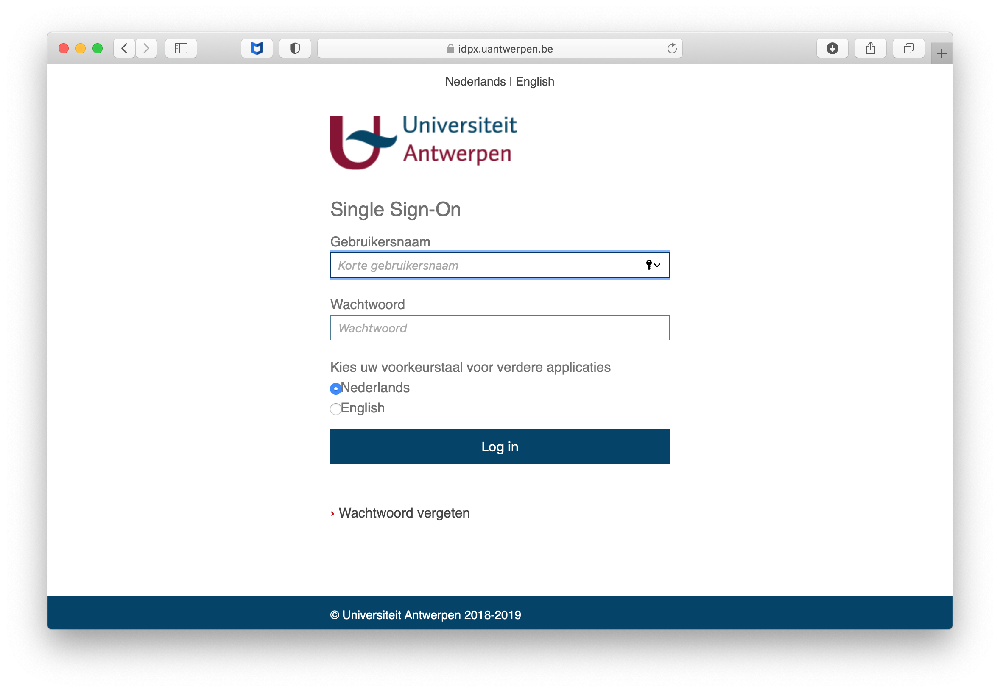
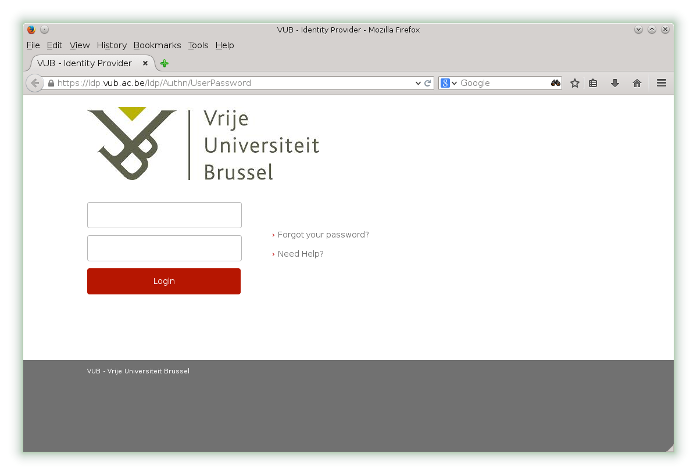
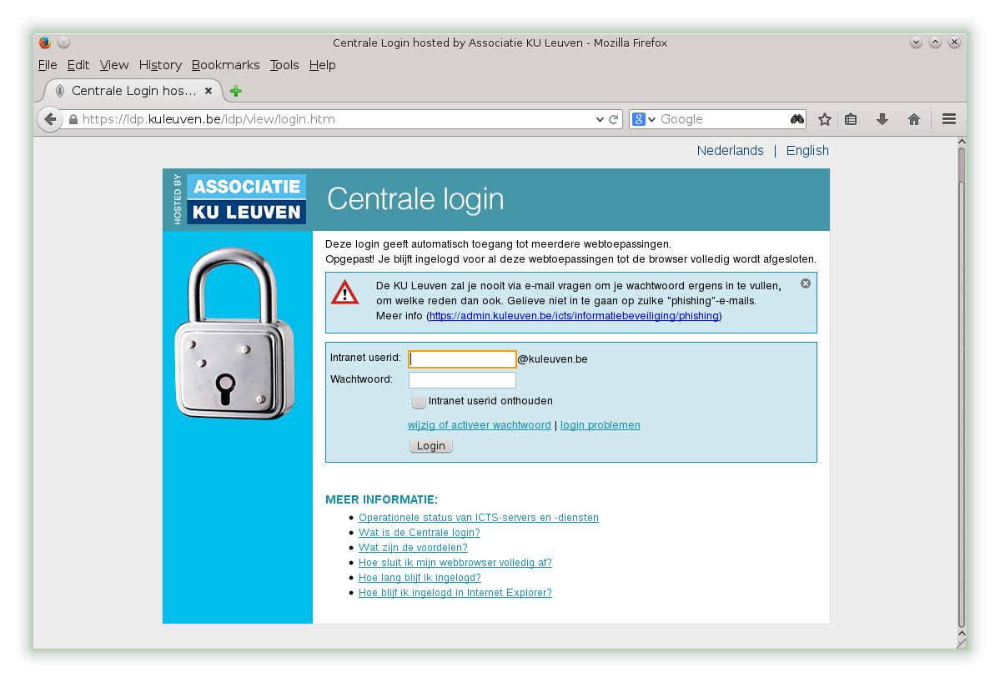

**This comes before, and it is a specific content for location {{ site }} - {{ OS }}.
Watch next section and the end of this page too.**

# Python computation macro
Following block of code is generated from Python code from `computational_macros/python/cat_file.py`.
This file was used as macro \{\{ cat_file \}\}. The file should contain just one function named same as the file.
All stuff should be done inside this function and the desired output should be returned in string format with properly 
escaped possibly problematic characters. Note that there are not properly escaped newlines in the example block of code 
to catch your eyes and show what needs to be beared in mind.

{{ cat_file }}

Another nice approach to have something more dynamic in the documentation is use of Javascript.
There is an example of clock ticking made by js:

<div id = "clock" onload="currentTime()"></div>
<script>
function currentTime() {
  let date = new Date();
  let hh = date.getHours();
  let mm = date.getMinutes();
  let ss = date.getSeconds();
  let session = "AM";
if(hh === 0){
      hh = 12;
  }
  if(hh > 12){
      hh = hh - 12;
      session = "PM";
   }
hh = (hh < 10) ? "0" + hh : hh;
   mm = (mm < 10) ? "0" + mm : mm;
   ss = (ss < 10) ? "0" + ss : ss;
let time = hh + ":" + mm + ":" + ss + " " + session;
document.getElementById("clock").innerText = time;
  let t = setTimeout(function(){ currentTime() }, 1000);
}
currentTime();
</script>

And here is a Python macro used by the variable `current_time` which contains a JS code 
generated by Python script/function named `current_time.py`.
It is in the 24h format to show it is a different function and it works. :)

{{ current_time }}


# Getting an HPC Account

## Getting ready to request an account


If you are affiliated with the {{ university }}, you can access {{ hpc }} using your NetID (the
same username and password that you use for accessing your university
email). Your {{ hpc }} account is not activated by default, you can do it via the
Personal Account Manager (PAM) homepage
(<https://idsapp.vub.ac.be/pam/>). Once you have activated your {{ hpcname }} account
you will be able to use only the HPC infrastructure of the {{ university }}. If you
would also like to use the HPC infrastructure located at other sites
within the Flemish Supercomputing Centre (VSC), then you have to apply
for a VSC account.


All users of {{ association }} can request

a VSC

an

account on the {{ hpc }}, which is part of the Flemish Supercomputing Centre (VSC).

See [HPC policies]() for more information on who is entitled to an account.

The VSC, abbreviation of Flemish Supercomputer Centre, is a virtual
supercomputer centre. It is a partnership between the five Flemish
associations: the Association KU Leuven, Ghent University Association,
Brussels University Association, Antwerp University Association and the
University Colleges-Limburg. The VSC is funded by the Flemish
Government.

The {{ hpcinfra }} clusters use public/private key pairs for user authentication
(rather than passwords). Technically, the private key is stored on your
local computer and always stays there; the public key is stored on the {{ hpc }}.
Access to the {{ hpc }} is granted to anyone who can prove to have access to the
corresponding private key on his local computer.

### How do SSH keys work?

-   an SSH public/private key pair can be seen as a lock and a key

-   the SSH public key is equivalent with a *lock*: you give it to the
    VSC and they put it on the *door* that gives access to your account.

-   the SSH private key is like a *physical key*: you don't hand it out
    to other people.

-   anyone who has the key (and the optional password) can unlock the
    *door* and log in to the account.

-   the *door* to your VSC account is special: it can have multiple
    *locks* (SSH public keys) attached to it, and you only need to open
    one *lock* with the corresponding *key* (SSH private key) to open
    the *door* (log in to the account).

Since all VSC clusters use Linux as their main operating system, you
will need to get acquainted with using the command-line interface and
using the terminal.


A typical Windows environment does not come with pre-installed software
to connect and run command-line executables on a {{ hpc }}. Some tools need to be
installed on your Windows machine first, before we can start the actual
work.

### Get PuTTY: A free telnet/SSH client

We recommend to use the PuTTY tools package, which is freely available.

You do not need to install PuTTY, you can download the PuTTY and
PuTTYgen executable and run it. This can be useful in situations where
you do not have the required permissions to install software on the
computer you are using. Alternatively, an installation package is also
available.

You can download PuTTY from the official address:
<https://www.chiark.greenend.org.uk/~sgtatham/putty/latest.html>. You
probably want the 64-bits version. If you can install software on your
computer, you can use the "Package files", if not, you can download and
use `putty.exe` and `puttygen.exe` in the "Alternative binary files"
section.

The PuTTY package consists of several components, but we'll only use
two:

1. **PuTTY**: *the Telnet and SSH client itself* (to login, see [Windows open a terminal]())

2.  **PuTTYgen**: *an RSA and DSA key generation utility* (to generate a key pair,
    see [Generate key pair]())

### Generating a public/private key pair

Before requesting a VSC account, you need to generate a pair of *ssh*
keys. You need 2 keys, a public and a private key. You can visualise the
public key as a lock to which only you have the key (your private key).
You can send a copy of your lock to anyone without any problems, because
only you can open it, as long as you keep your private key secure. To
generate a public/private key pair, you can use the PuTTYgen key
generator.

Start ***PuTTYgen.exe*** it and follow these steps:

1.  In ++"Parameters"++ (at the bottom of the window), choose "RSA" and set the number of
    bits in the key to 4096.

    { style="display: block; margin: 0 auto" }

2.  Click on ++"Generate"++. To generate the key, you must move the mouse cursor over
    the PuTTYgen window (this generates some random data that PuTTYgen
    uses to generate the key pair). Once the key pair is generated, your
    public key is shown in the field ++"Public key for pasting into OpenSSH authorized_keys file"++.

3.  Next, it is advised to fill in the ++"Key comment"++ field to make it easier
    identifiable afterwards.

4.  Next, you should specify a passphrase in the ++"Key passphrase"++ field and retype it in
    the ++"Confirm passphrase"++ field. Remember, the passphrase protects the private key against
    unauthorised use, so it is best to choose one that is not too easy
    to guess but that you can still remember. Using a passphrase is not
    required, but we recommend you to use a good passphrase unless you
    are certain that your computer's hard disk is encrypted with a
    decent password. (If you are not sure your disk is encrypted, it
    probably isn't.)

    { style="display: block; margin: 0 auto" }

5.  Save both the public and private keys in a folder on your personal
    computer (We recommend to create and put them in the folder
    "C:\\Users\\%USERNAME%\\AppData\\Local\\PuTTY\\.ssh") with the
    buttons ++"Save public key"++ and ++"Save private key"++. We recommend using the name **"id_rsa.pub"** for the public key, and
    **"id_rsa.ppk"** for the private key.


6.  Finally, save an "OpenSSH" version of your private key (in
    particular for later "X2Go" usage, see [x2go]()) by entering the
    "Conversions" menu and selecting "Export OpenSSH key" (do **not** select the
    "force new file format" variant). Save the file in the same location
    as in the previous step with filename **"id_rsa"**. (If there is no
    "Conversions" menu, you must update your "puttygen" version. If you
    want to do this conversion afterwards, you can start with loading an
    existing "id_rsa.ppk" and only do this conversions export.)

    { style="display: block; margin: 0 auto" }



If you use another program to generate a key pair, please remember that
they need to be in the OpenSSH format to access the {{ hpc }} clusters.



To open a Terminal window in macOS, open the Finder and choose

*\>\> Applications \> Utilities \> Terminal*

Before requesting an account, you need to generate a pair of ssh keys.
One popular way to do this on {{ OS }} is using the OpenSSH client included with {{ OS }}, which you can then also use to log on to the clusters.



Launch a terminal from your desktop's application menu and you will see
the bash shell. There are other shells, but most Linux distributions use
bash by default.



### Test OpenSSH

Secure Shell (ssh) is a cryptographic network protocol for secure data
communication, remote command-line login, remote command execution, and
other secure network services between two networked computers. In short,
ssh provides a secure connection between 2 computers via insecure
channels (Network, Internet, telephone lines, ...).

"Secure" means that:

1.  the User is authenticated to the System; and

2.  the System is authenticated to the User; and

3.  all data is encrypted during transfer.

OpenSSH is a FREE implementation of the SSH connectivity protocol. {{ OS }} comes
with its own implementation of OpenSSH, so you don't need to install any
third-party software to use it. Just open a terminal window and jump in!

On all popular Linux distributions, the OpenSSH software is readily
available, and most often installed by default. You can check whether
the OpenSSH software is installed by opening a terminal and typing:

```
$ ssh -V
OpenSSH_7.4p1, OpenSSL 1.0.2k-fips 26 Jan 2017
```

To access the clusters and transfer your files, you will use the
following commands:

1.  ssh-keygen: to generate the ssh keysgenerate a public

2.  ssh: to open a shell on a remote machine;

3.  sftp: a secure equivalent of ftp;

4.  scp: a secure equivalent of the remote copy command rcp.

### Generate a public/private key pair with OpenSSH

A key pair might already be present in the default location inside your
home directory. Therefore, we first check if a key is available with the
"list short" ("ls") command:

```
$ ls ~/.ssh
```

If a key-pair is already available, you would normally get:
```
authorized_keys     id_rsa      id_rsa.pub      known_hosts
```

Otherwise, the command will show:

```
ls: .ssh: No such file or directory
```

You can recognise a public/private key pair when a pair of files has the
same name except for the extension ".pub" added to one of them. In this
particular case, the private key is "id_rsa" and public key is
"id_rsa.pub". You may have multiple keys (not necessarily in the
directory "~/.ssh") if you or your operating system requires this. Be
aware that your existing key pair might be too short, or not the right
type.

You will need to generate a new key pair, when:

1.  you don't have a key pair yet

2.  you forgot the passphrase protecting your private key

3.  or your private key was compromised

4.  your key pair is too short or not the right type

For extra security, the private key itself can be encrypted using a
"passphrase", to prevent anyone from using your private key even when
they manage to copy it. You have to "unlock" the private key by typing
the passphrase. Be sure to never give away your private key, it is
private and should stay private. You should not even copy it to one of
your other machines, instead, you should create a new public/private key
pair for each machine.

```
$ ssh-keygen -t rsa -b 4096
Generating public/private rsa key pair. Enter file in which to save the
key (/home/user/.ssh/id_rsa): Enter passphrase (empty for no
passphrase): Enter same passphrase again: Your identification has been
saved in /home/user/.ssh/id_rsa. Your public key has been saved in
/home/user/.ssh/id_rsa.pub.
```

This will ask you for a file name to store the private and public key,
and a passphrase to protect your private key. It needs to be emphasised
that you really should choose the passphrase wisely! The system will ask
you for it every time you want to use the private key that is every time
you want to access the cluster or transfer your files.

**Without your key pair, you won't be able to apply for a personal VSC account.**


### Using an SSH agent (optional)


It is possible to setup a SSH agent in Windows. This is an optional
configuration to help you to keep all your SSH keys (if you have
several) stored in the same key ring to avoid to type the SSH key
password each time. The SSH agent is also necessary to enable SSH hops
with key forwarding from Windows.

**Pageant** is the SSH authentication agent used in windows. This agent should be
available from the PuTTY installation package
<https://www.chiark.greenend.org.uk/~sgtatham/putty/latest.html> or as
stand alone binary package.

After the installation just start the Pageant application in Windows,
this will start the agent in background. The agent icon will be visible
from the Windows panel.

{ style="display: block; margin: 0 auto" }

At this point the agent does not contain any private key. You should
include the private key(s) generated in the previous section [Generate key pair]().

1.  Click on ++"Add key"++

    { style="display: block; margin: 0 auto" }

2.  Select the private key file generated in [Generate key pair]() (**"id_rsa.ppk"** by default).

3.  Enter the same SSH key password used to generate the key. After this
    step the new key will be included in Pageant to manage the SSH
    connections.

4.  You can see the SSH key(s) available in the key ring just clicking
    on ++"View Keys"++.

    { style="display: block; margin: 0 auto" }

5.  You can change **PuTTY** setup to use the SSH agent. Open PuTTY and check
    *Connection > SSH > Auth > Allow agent forwarding*.

    { style="display: block; margin: 0 auto" }

Now you can connect to the login nodes as usual. The SSH agent will know
which SSH key should be used and you do not have to type the SSH
passwords each time, this task is done by agent automatically.

It is also possible to use **WinSCP** with **Pageant**, see
<https://winscp.net/eng/docs/ui_pageant> for more details.



Most recent Unix derivatives include by default an SSH agent 
 (``gnome-keyring-daemon'' in most cases)  
to keep and manage the user SSH keys. If you use one of these derivatives you **must** include the new keys into
the SSH manager keyring to be able to connect to the HPC cluster. If
not, SSH client will display an error message (see [Connecting]()) similar to this:

```
Agent admitted failure to sign using the key. 
Permission denied (publickey,gssapi-keyex,gssapi-with-mic).
```

This could be fixed using the `ssh-add` command. You can include the new
private keys' identities in your keyring with:

```
$ ssh-add
```

!!! tip
    Without extra options `ssh-add` adds any key located at `$HOME/.ssh`
    directory, but you can specify the private key location path as
    argument, as example: `ssh-add /path/to/my/id_rsa`.


Check that your key is available from the keyring with:

```
$ ssh-add -l
```

After these changes the key agent will keep your SSH key to connect to
the clusters as usual.

!!! tip
    You should execute `ssh-add` command again if you generate a new SSH
    key.


    

Visit <https://wiki.gnome.org/Projects/GnomeKeyring/Ssh> for more information.


## Applying for the account

Visit <https://account.vscentrum.be/>

You will be redirected to our WAYF (Where Are You From) service where
you have to select your "Home Organisation".


{ style="display: block; margin: 0 auto" }

Select "{{ wayf }}" in the dropdown box and optionally select "Save my preference"
and "permanently".

Click ++"Confirm"++

You will now be taken to the authentication page of your institute.


{ style="display: block; margin: 0 auto" }

**The site is only accessible from within the {{ university }}
domain**, so the page won't load from, e.g., home. However, you can also get
external access to the {{ university }} domain using VPN. We refer to the Pintra pages of
the ICT Department for more information.

### Users of the {{ association }}

All users (researchers, academic staff, etc.) from the higher education
institutions associated with {{ university }} can get a VSC account via the {{ university }}. There is
not yet an automated form to request your personal VSC account.

Please e-mail the {{ hpc }} staff to get an account (see Contacts information).
You will have to provide a public *ssh* key generated as described
above. Please attach your public key (i.e., the file named
`id_rsa.pub`), which you will normally find in your .ssh subdirectory
within your HOME Directory. (i.e., `/Users/<username>/.ssh/id_rsa.pub`).



You will now have to log in with CAS using your UGent account.

You either have a login name of maximum 8 characters, or a (non-UGent)
email address if you are an external user. In case of problems with your
UGent password, please visit: <https://password.ugent.be/>. After
logging in, you may be requested to share your information. Click "Yes,
continue".

{ style="display: block; margin: 0 auto" }



{ style="display: block; margin: 0 auto" }
You will now have to log in using your NetID. (The same username and
password that you use for accessing your e-mail)



{{ hpc }} users should login using their staff or student id (The same username
and password that is used for accessing e-mail).

{ style="display: block; margin: 0 auto" }

{ style="display: block; margin: 0 auto" }


After you log in using your {{ university }} login and password, you will be asked to
upload the file that contains your public key, i.e., the file
"id_rsa.pub" which you have generated earlier. Make sure that your
public key is actually accepted for upload, beacuse if it is in a wrong
format, wrong type or too short, then it will be refused.

"
This file should have been stored in the directory
"C:\\Users\\%USERNAME%\\AppData\\Local\\PuTTY\\.ssh"


This file has been stored in the directory "*~/.ssh/*".



!!! tip
    As ".ssh" is an invisible directory, the Finder will not show it by
    default. The easiest way to access the folder, is by pressing ++cmd+shift+g++ ,
    which will allow you to enter the name of a directory, which you would
    like to open in Finder. Here, type "~/.ssh" and press enter.


After you have uploaded your public key you will receive an e-mail with
a link to confirm your e-mail address. After confirming your e-mail
address the VSC staff will review and if applicable approve your
account.

### Welcome e-mail

Within one day, you should receive a Welcome e-mail with your VSC
account details.

```
Dear (Username), 
Your VSC-account has been approved by an administrator.
Your vsc-username is {{ userid }}

Your account should be fully active within one hour.

To check or update your account information please visit
https://account.vscentrum.be/

For further info please visit https://www.vscentrum.be/user-portal

Kind regards,
-- The VSC administrators
```

Now, you can start using the {{ hpc }}. You can always look up your VSC id later
by visiting <https://account.vscentrum.be>.

### Adding multiple SSH public keys (optional)

In case you are connecting from different computers to the login nodes,
it is advised to use separate SSH public keys to do so. You should
follow these steps.


1.  Create a new public/private SSH key pair from Putty. Repeat the
    process described in
    section [Generate a public/private key pair](#generate-a-publicprivate-key-pair).

1.  Create a new public/private SSH key pair from the new computer.
    Repeat the process described in
    section [Generate a public/private key pair with OpenSSH](#generate-a-publicprivate-key-pair-with-openssh).

2.  Go to <https://account.vscentrum.be/django/account/edit>

3.  Upload the new SSH public key using the **Add public key** section. Make sure that your
    public key is actually saved, because a public key will be refused
    if it is too short, wrong type, or in a wrong format.

4.  (optional) If you lost your key, you can delete the old key on the
    same page. You should keep at least one valid public SSH key in your
    account.

5.  Take into account that it will take some time before the new SSH
    public key is active in your account on the system; waiting for
    15-30 minutes should be sufficient.

## Computation Workflow on the {{ hpc }}

A typical Computation workflow will be:

1.  Connect to the {{ hpc }}

2.  Transfer your files to the {{ hpc }}

3.  Compile your code and test it

4.  Create a job script

5.  Submit your job

6.  Wait while

    1.  your job gets into the queue

    2.  your job gets executed

    3.  your job finishes

7.  Move your results

We'll take you through the different tasks one by one in the following
chapters.

**Now you know how to extend the existing page. If you want to change something inside another 
document you must indeed copy this document and create your own edited version.**
