# Troubleshooting

## Why does my job not run faster when using more nodes and/or cores? { #job_does_not_run_faster }
Requesting more resources for your job, more specifically using multiple cores and/or nodes, 
does not automatically imply that your job will run faster. 
There are various factors that determine to what extent these extra resources can be used and how efficiently they can be used. 
More information on this in the subsections below.


### Using multiple cores
When you want to speed up your jobs by requesting multiple cores, you also need to use software that is actually capable of 
using them (and use them efficiently, ideally).
Unless a particular parallel programming paradigm like [OpenMP](https://www.openmp.org/about/openmp-faq/#WhatIs) threading 
(shared memory) or [MPI](https://en.wikipedia.org/wiki/Message_Passing_Interface) (distributed memory) is used, 
software will run sequentially (on a single core).

To use multiple cores, the software needs to be able to create, manage, and synchronize multiple threads or processes. 
More on how to implement parallelization for you exact programming language can be found online.
Note that when using software that only uses *threads* to use multiple cores, there is no point in asking for multiple *nodes*, 
since with a multi-threading (shared memory) approach you can only use the resources (cores, memory) of a *single* node.

Even if your software is able to use multiple cores, maybe there is no point in going beyond a single core or a handful of cores, 
for example because the workload you are running is too small or does not parallelize well.
You can test this by increasing the amount of cores step-wise, and look at the speedup you gain. For example, 
test with 2, 4, 16, a quarter of, half of, and all available cores.

Other reasons why using more cores may not lead to a (significant) speedup include:

- **Overhead:** When you use multi-threading (OpenMP) or multi-processing (MPI), 
you should *not* expect that doubling the amount of cores will result in a 2x speedup. 
This is due to the fact that time is needed to create, manage and synchronize the threads/processes.
When this "bookkeeping" overhead exceeds the time gained by parallelization, you will not observe any speedup (or even see slower runs).
For example, this can happen when you split your program in too many (tiny) tasks to run in parallel - 
creating a thread/process for each task may even take longer than actually running the task itself.

- **[Amdahl's Law](https://en.wikipedia.org/wiki/Amdahl%27s_law)** is often used in parallel computing to predict the maximum achievable (theoretical) speedup when using multiple cores. 
It states that "*the overall performance improvement gained by optimizing a single part of a system is limited by the fraction of time that the improved part is actually used*". 
For example, if a program needs 20 hours to complete using a single core, but a one-hour portion of the program can not be parallelized, 
only the remaining 19 hours of execution time can be sped up using parallelization. 
Regardless of how many cores are devoted to a parallelized execution of this program, the minimum execution time is always more than 1 hour. 
So when you reach this theoretical limit, using more cores will not help at all to speed up the computational workload.

- **Resource contention:** When two or more threads/processes want to access the same resource, they need to wait on each other - this is called resource contention. 
As a result, 1 thread/process will need to wait until the other one is finished using that resource. 
When each thread uses the same resource, it will definitely run slower than if it doesn't need to wait for other threads to finish.

- **Software limitations:** It is possible that the software you are using is just not really optimized for parallelization. 
An example of a software that is not really optimized for multi-threading is Python (although this has improved over the years).
This is due to the fact that in Python threads are implemented in a way that multiple threads can not run at the same time, due to the [global interpreter lock (GIL)](https://en.wikipedia.org/wiki/Global_interpreter_lock). 
Instead of using multi-threading in Python to speedup a CPU bound program, you should use multi-processing instead, 
which uses multiple processes (multiple instances of the same program) instead of multiple threads in a single program instance.
Using multiple processes can speed up your CPU bound programs a lot more *in Python* than threads can do, even though they are much less efficient to create.
In other programming languages (which don't have a GIL), you would probably still want to use threads.

- **[Affinity and core pinning](https://www.admin-magazine.com/HPC/Articles/Processor-Affinity-for-OpenMP-and-MPI)**: 
Even when the software you are using is able to efficiently use multiple cores, you may not see any speedup (or even a significant slowdown).
This could be due to threads or processes that are not pinned to specific cores and keep hopping around between cores, 
or because the pinning is done incorrectly and several threads/processes are being pinned to the same core(s), and thus keep "fighting" each other.

- **Lack of sufficient memory**: When there is not enough memory available, or not enough memory bandwidth, 
it is likely that you will not see a significant speedup when using more cores (since each thread or process most likely requires additional memory).

More info on running multi-core workloads on the {{ hpcinfra }} can be found [here](multi_core_jobs.md).

### Using multiple nodes
When trying to use multiple (worker)nodes to improve the performance of your workloads, you may not see (significant) speedup.

Parallelizing code across nodes is fundamentally different from leveraging multiple cores via multi-threading within a single node.
The scalability achieved through multi-threading does not extend seamlessly to distributing computations across multiple nodes.
This means that just changing `#PBS -l nodes=1:ppn=10` to `#PBS -l nodes=2:ppn=10` may only increase the waiting time to get your job running (because twice as many resources are requested), and will not improve the execution time.

Actually using additional nodes is not as straightforward as merely asking for multiple nodes when submitting your job. The resources on these additional nodes often need to discovered, managed, and synchronized. This introduces complexities in distributing work effectively across the nodes. Luckily, there exist some libraries that do this for you.

Using the resources of multiple nodes is often done using a [Message Passing Interface (MPI)](https://en.wikipedia.org/wiki/Message_Passing_Interface) library.
MPI allows nodes to communicate and coordinate, but it also introduces additional complexity.

An example of how you can make beneficial use of multiple nodes can be found [here](multi_core_jobs.md#parallel-computing-with-mpi).

You can also use MPI in Python, some useful packages that are also available on the HPC are:

-   [mpi4py](https://mpi4py.readthedocs.io/en/stable/mpi4py.html)
-   [Boost.MPI](https://www.boost.org/doc/libs/1_55_0/doc/html/mpi/python.html)

We advise to maximize core utilization before considering using multiple nodes.
Our [infrastructure](https://www.ugent.be/hpc/en/infrastructure) has clusters with a lot of cores per node so we suggest that you first try to use all the cores on 1 node before you expand to more nodes.
In addition, when running MPI software we strongly advise to use our [mympirun](mympirun.md) tool.

### How do I know if my software can run in parallel?
If you are not sure if the software you are using can efficiently use multiple cores or run across multiple nodes, 
you should check its documentation for instructions on how to run in parallel, 
or check for options that control how many threads/cores/nodes can be used.

If you can not find any information along those lines, the software you are using can probably only use a single core 
and thus requesting multiple cores and/or nodes will only result in wasted resources.


## Walltime issues

If you get from your job output an error message similar to this:

```
=>> PBS: job killed: walltime <value in seconds> exceeded limit  <value in seconds>
```

This occurs when your job did not complete within the requested
walltime. See
section on [Specifying Walltime](../fine_tuning_job_specifications/#specifying-walltime) for more information
about how to request the walltime.

## Out of quota issues

Sometimes a job hangs at some point or it stops writing in the disk.
These errors are usually related to the quota usage. You may have
reached your quota limit at some storage endpoint. You should move (or
remove) the data to a different storage endpoint (or request more quota)
to be able to write to the disk and then resubmit the jobs. 

Another
option is to request extra quota for your VO to the VO moderator/s. See
section on [Pre-defined user directories](../running_jobs_with_input_output_data/#pre-defined-user-directories) and [Pre-defined quotas](../running_jobs_with_input_output_data/#pre-defined-quotas) for more information about quotas
and how to use the storage endpoints in an efficient way.


## Issues connecting to login node { #sec:connecting-issues}

If you are confused about the SSH public/private key pair concept, maybe
the key/lock analogy in [How do SSH keys work?](../account/#how-do-ssh-keys-work) can help.

If you have errors that look like:

```
{{ userid }}@{{ loginnode }}: Permission denied
```

or you are experiencing problems with connecting, here is a list of
things to do that should help:

1.  Keep in mind that it can take up to an hour for your VSC account to
    become active after it has been *approved*; until then, logging in
    to your VSC account will not work.

2.  Make sure you are connecting from an IP address that is allowed to
    access the VSC login nodes, see
    section [Connection restrictions](../connecting/#connection-restrictions)
    for more information.

3.  Your SSH private key may not be in the default location
    (`$HOME/.ssh/id_rsa`). There are several ways to deal with this
    (using one of these is sufficient):
    1. Use the `ssh -i` (see section [Connect](../connecting/#connect)) *OR;*
    2. Use `ssh-add` (see section [Using an SSH agent](../account/#using-an-ssh-agent-optional)) *OR;*
    3. Specify the location of the key in `$HOME/.ssh/config`. You will
                need to replace the VSC login id in the `User` field with your own:
                ```
                Host {{ hpcname }}
                    Hostname {{ loginnode }}
                    IdentityFile /path/to/private/key
                    User {{ userid }}
                ```
        Now you can connect with `ssh {{ hpcname }}`.


4.  Please double/triple check your VSC login ID. It should look
    something like *{{ userid }}*: the letters `vsc`, followed by exactly 5 digits.
    Make sure it's the same one as the one on
    <https://account.vscentrum.be/>.

5.  You previously connected to the {{ hpc }} from another machine, but now have
    another machine? Please follow the procedure for adding additional
    keys in section [Adding multiple SSH public keys](../account/#adding-multiple-ssh-public-keys-optional). You may need to wait for
    15-20 minutes until the SSH public key(s) you added become active.

1.  
    
    Make sure you are using the private key (not the public key) when
    trying to connect: If you followed the manual, the private key
    filename should end in `.ppk` (not in `.pub`). 
    

    When using an SSH key
    in a non-default location, make sure you supply the path of the
    private key (and not the path of the public key) to `ssh`.
    `id_rsa.pub` is the usual filename of the public key, `id_rsa` is
    the usual filename of the private key. (See also
    section [Connect](../connecting/#connect))


1.  If you have multiple private keys on your machine, please make sure
    you are using the one that corresponds to (one of) the public key(s)
    you added on <https://account.vscentrum.be/>.

2.  Please do not use someone else's private keys. You must never share
    your private key, they're called *private* for a good reason.


If you are using PuTTY and get this error message:

```
server unexpectedly closed network connection
```

it is possible that the PuTTY version you are using is too old and
doesn't support some required (security-related) features.

Make sure you are using the latest PuTTY version if you are encountering
problems connecting (see [Get PuTTY](../account/#get-putty-a-free-telnetssh-client)). If that doesn't help, please contact {{ hpcinfo }}.


If you've tried all applicable items above and it doesn't solve your
problem, please contact {{ hpcinfo }} and include the following information:


Please create a log file of your SSH session by following the steps in
[this article](https://my.kualo.com/knowledgebase/?kbcat=0&article=888)
and include it in the email.

### Change PuTTY private key for a saved configuration

1.  Open PuTTY

2.  Single click on the saved configuration

    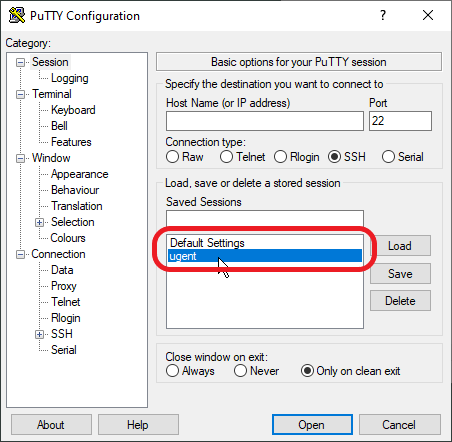

3.  Then click ++"Load"++ button

    

4.  Expand SSH category (on the left panel) clicking on the "+" next
    to SSH

    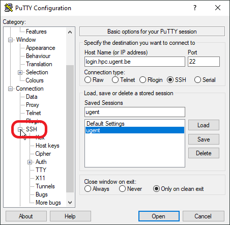

5.  Click on Auth under the SSH category

    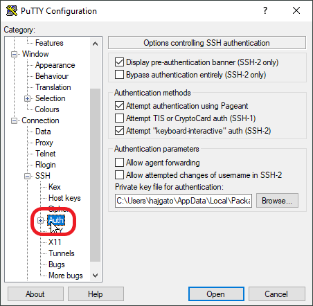

6.  On the right panel, click ++"Browse"++ button

    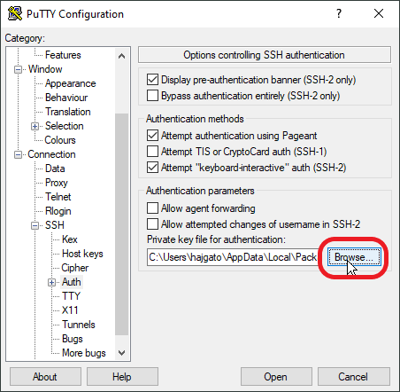

7.  Then search your private key on your computer (with the extension
    ".ppk")

8.  Go back to the top of category, and click Session

    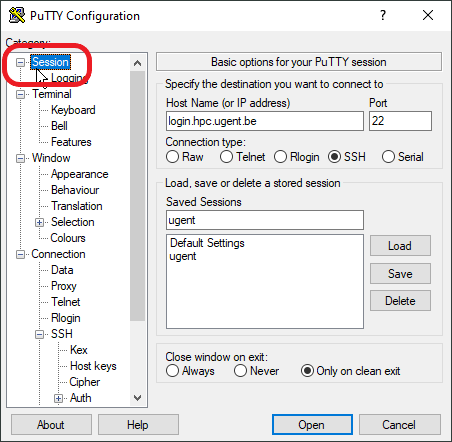

9.  On the right panel, click on ++"Save"++ button

    

### Check whether your private key in PuTTY matches the public key on the accountpage

Follow the instructions in [Change PuTTY private key for a saved configuration](../troubleshooting/#change-putty-private-key-for-a-saved-configuration) util item 5, then:

1.  Single click on the textbox containing the path to your private key,
    then select all text (push ++"Ctrl"++ + ++"a"++ ), then copy the location of the
    private key (push ++"Ctrl"++ + ++"c"++)

    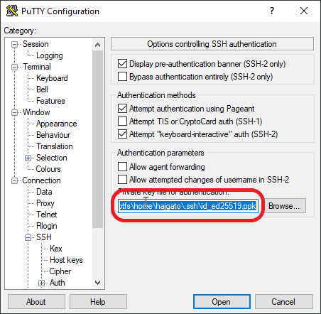

2.  Open PuTTYgen

    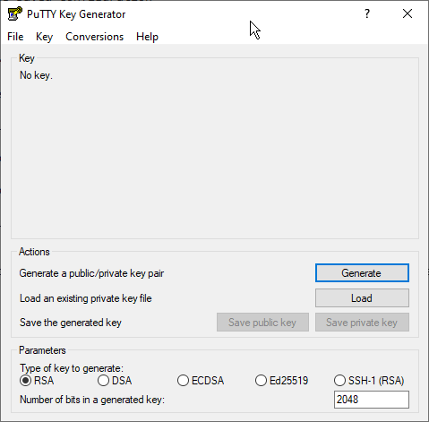

3.  Enter menu item "File" and select "Load Private key"

    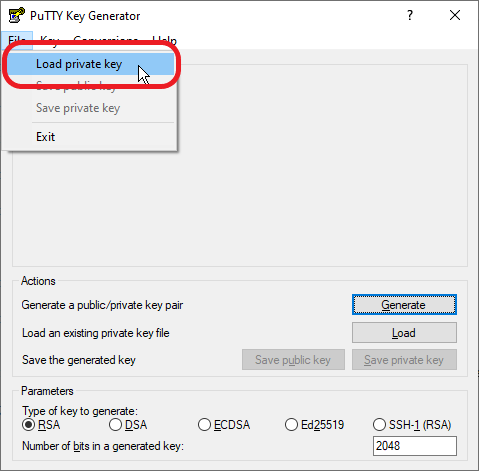

4.  On the "Load private key" popup, click in the textbox next to
    "File name:", then paste the location of your private key (push ++"Ctrl"++ + ++"v"++), then click ++"Open"++

    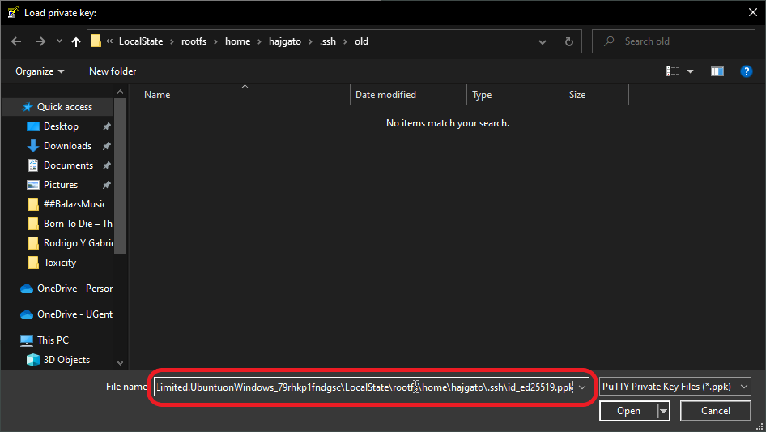

5.  Make sure that your Public key from the "Public key for pasting
    into OpenSSH authorized_keys file" textbox is in your "Public
    keys" section on the accountpage <https://account.vscentrum.be>.
    (Scroll down to the bottom of "View Account" tab, you will find
    there the "Public keys" section)

    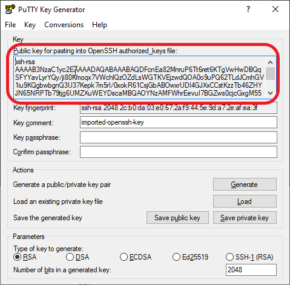


Please add `-vvv` as a flag to `ssh` like:

```
ssh -vvv {{ userid }}@{{ loginnode }}
```

and include the output of that command in the message.


## Security warning about invalid host key

If you get a warning that looks like the one below, it is possible that
someone is trying to intercept the connection between you and the system
you are connecting to. Another possibility is that the host key of the
system you are connecting to has changed.



```
@@@@@@@@@@@@@@@@@@@@@@@@@@@@@@@@@@@@@@@@@@@@@@@@@@@@@@@@@@@ 
@     WARNING: REMOTE HOST IDENTIFICATION HAS CHANGED!    @
@@@@@@@@@@@@@@@@@@@@@@@@@@@@@@@@@@@@@@@@@@@@@@@@@@@@@@@@@@@ 
IT IS POSSIBLE THAT SOMEONE IS DOING SOMETHING NASTY! 
Someone could be
eavesdropping on you right now (man-in-the-middle attack)! 
It is also possible that a host key has just been changed. 
The fingerprint for the ECDSA key sent by the remote host is
SHA256:1MNKFTfl1T9sm6tTWAo4sn7zyEfiWFLKbk/mlT+7S5s. 
Please contact your system administrator. 
Add correct host key in  ~/.ssh/known_hosts to get rid of this message. 
Offending ECDSA key in  ~/.ssh/known_hosts:21
ECDSA host key for {{ loginnode }} has changed and you have requested strict checking.
Host key verification failed.
```

You will need to remove the line it's complaining about (in the example,
line 21). To do that, open `~/.ssh/known_hosts` in an editor, and remove the
line. This results in `ssh` "forgetting" the system you are connecting
to.

Alternatively you can use the command that might be shown by the warning under
`remove with:` and it should be something like this:

```
ssh-keygen -f "~/.ssh/known_hosts" -R "{{loginnode}}"
```

If the command is not shown, take the file from the "Offending ECDSA key in",
and the host name from "ECDSA host key for" lines.

After you've done that, you'll need to connect to the {{ hpc }} again. See [Warning message when first connecting to new host](./#warning-message-when-first-connecting-to-new-host) to verify the fingerprints.


You will need to verify that the fingerprint shown in the dialog matches
one of the following fingerprints:

```
{{ puttyFirstConnect }}
```

**Do not click "Yes" until you verified the fingerprint. Do not press "No" in any case.**

If the fingerprint matches, click "Yes".

If it doesn't (like in the example) or you are in doubt, take a screenshot, press "Cancel" and contact {{ hpcinfo }}.



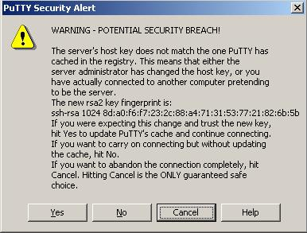


If you use X2Go client, you might get one of the following fingerprints:

{{xtwogoshaone}}

**If you get a message "Host key for server changed", do not click "No" until you verified the fingerprint.**

If the fingerprint matches, click "No", and in the next pop-up screen ("if you accept the new host key..."), press "Yes".

If it doesn't, or you are in doubt, take a screenshot, press "Yes" and contact {{hpcinfo}}.




## DOS/Windows text format

If you get errors like:

```
qsub fibo.pbs
qsub: script is written in DOS/Windows text format
```

or

```
sbatch: error: Batch script contains DOS line breaks (\r\n)
```

It's probably because you transferred the files from a Windows computer.
See the [section about `dos2unix` in Linux tutorial](https://hpcugent.github.io/vsc_user_docs/linux-tutorial/uploading_files/#dos2unix) to fix this error.

## Warning message when first connecting to new host



```
ssh {{userid}}@{{loginnode}}
The authenticity of host {{loginnode}} (<IP-adress>) can't be established. 
<algorithm> key fingerprint is <hash>
Are you sure you want to continue connecting (yes/no)?
```

Now you can check the authenticity by checking if the line that is at
the place of the underlined piece of text matches one of the following
lines:

```
{{opensshFirstConnect}}
```


 


If you use X2Go, then you might get another fingerprint, then make sure that the fingerprint
is displayed is one of the following ones:

{{xtwogoshaone}}




If it does, type ***yes***. If it doesn't, please contact support: {{hpcinfo}}.





If you use X2Go, then you might get another fingerprint, then make sure that the fingerprint
is displayed is one of the following ones:

{{xtwogoshaone}}



## Memory limits

To avoid jobs allocating too much memory, there are memory limits in
place by default. It is possible to specify higher memory limits if your
jobs require this.

!!! note

    Memory is not the same as storage. Memory or RAM is used for temporary, 
    fast access to data when the program is running, while storage is used for long-term data retention.
    If you are running into problems because you reached your storage quota, see [Out of quota issues](#out-of-quota-issues).

### How will I know if memory limits are the cause of my problem?

If your program fails with a memory-related issue, there is a good
chance it failed because of the memory limits and you should increase
the memory limits for your job.

Examples of these error messages are: `malloc failed`, `Out of memory`,
`Could not allocate memory` or in Java:
`Could not reserve enough space for object heap`. Your program can also
run into a `Segmentation fault` (or `segfault`) or crash due to bus
errors.

You can check the amount of virtual memory (in Kb) that is available to
you via the `ulimit -v` command *in your job script*.

### How do I specify the amount of memory I need?

See [Generic resource requirements](../running_batch_jobs/#generic-resource-requirements) to set memory and other requirements, see [Specifying memory requirements](../fine_tuning_job_specifications/#specifying-memory-requirements) to finetune the amount of
memory you request.


## Module conflicts

Modules that are loaded together must use the same toolchain version: it
is impossible to load two versions of the same module. In the following
example, we try to load a module that uses the `intel-2018a` toolchain
together with one that uses the `intel-2017a` toolchain:

```
$ module load Python/2.7.14-intel-2018a
$ module load  HMMER/3.1b2-intel-2017a
Lmod has detected the following error: A different version of the 'intel' module is already loaded (see output of 'ml'). 
You should load another 'HMMER' module for that is compatible with the currently loaded version of 'intel'. 
Use 'ml avail HMMER' to get an overview of the available versions.

If you don't understand the warning or error, contact the helpdesk at hpc@ugent.be 
While processing the following module(s):

    Module fullname          Module Filename
    ---------------          ---------------
    HMMER/3.1b2-intel-2017a  /apps/gent/CO7/haswell-ib/modules/all/HMMER/3.1b2-intel-2017a.lua
```

This resulted in an error because we tried to load two different
versions of the `intel` module.

To fix this, check if there are other versions of the modules you want to load
that have the same version of common dependencies. You can list all versions of
a module with `module avail`: for `HMMER`, this command is `module avail HMMER`.

Another common error is:

```
$ module load cluster/{{othercluster}}
Lmod has detected the following error: A different version of the 'cluster' module is already loaded (see output of 'ml').

If you don't understand the warning or error, contact the helpdesk at hpc@ugent.be
```

This is because there can only be one `cluster` module active at a time.
The correct command is `module swap cluster/{{othercluster}}`. See also [Specifying the cluster on which to run](../running_batch_jobs/#specifying-the-cluster-on-which-to-run).



## `Illegal instruction` error

### Running software that is incompatible with host
When running software provided through modules (see [Modules](../running_batch_jobs/#modules)), you may run into
errors like:

```
$ module swap cluster/donphan
The following have been reloaded with a version change:
  1) cluster/doduo => cluster/donphan         3) env/software/doduo => env/software/donphan
  2) env/slurm/doduo => env/slurm/donphan     4) env/vsc/doduo => env/vsc/donphan

$ module load Python/3.10.8-GCCcore-12.2.0
$ python
Please verify that both the operating system and the processor support
Intel(R) MOVBE, F16C, FMA, BMI, LZCNT and AVX2 instructions.
```

or errors like:

```
$ python
Illegal instruction
```

When we swap to a different cluster, the available modules change so
they work for that cluster. That means that if the cluster and the login
nodes have a different CPU architecture, software loaded using modules
might not work.

If you want to test software on the login nodes, make sure the
`cluster/{{defaultcluster}}` module is loaded (with `module swap cluster/{{defaultcluster}}`, see [Specifying the cluster on which to run](../running_batch_jobs/#specifying-the-cluster-on-which-to-run)), since
the login nodes and have the same CPU architecture.

If modules are already loaded, and then we swap to a different cluster,
all our modules will get reloaded. This means that all current modules
will be unloaded and then loaded again, so they'll work on the newly
loaded cluster. Here's an example of how that would look like:

```
$ module load Python/3.10.8-GCCcore-12.2.0
$ module swap cluster/donphan

Due to MODULEPATH changes, the following have been reloaded:
  1) GCCcore/12.2.0                   8) binutils/2.39-GCCcore-12.2.0
  2) GMP/6.2.1-GCCcore-12.2.0         9) bzip2/1.0.8-GCCcore-12.2.0
  3) OpenSSL/1.1                     10) libffi/3.4.4-GCCcore-12.2.0
  4) Python/3.10.8-GCCcore-12.2.0    11) libreadline/8.2-GCCcore-12.2.0
  5) SQLite/3.39.4-GCCcore-12.2.0    12) ncurses/6.3-GCCcore-12.2.0
  6) Tcl/8.6.12-GCCcore-12.2.0       13) zlib/1.2.12-GCCcore-12.2.0
  7) XZ/5.2.7-GCCcore-12.2.0

The following have been reloaded with a version change:
  1) cluster/doduo => cluster/donphan         3) env/software/doduo => env/software/donphan
  2) env/slurm/doduo => env/slurm/donphan     4) env/vsc/doduo => env/vsc/donphan
```

This might result in the same problems as mentioned above. When swapping
to a different cluster, you can run `module purge` to unload all modules
to avoid problems (see [Purging all modules](../running_batch_jobs/#purging-all-modules)).

### Multi-job submissions on a non-default cluster

When using a tool that is made available via modules to submit jobs, for example [Worker](multi_job_submission.md),
you may run into the following error when targeting a non-default cluster:

```
$  wsub
/apps/gent/.../.../software/worker/.../bin/wsub: line 27: 2152510 Illegal instruction     (core dumped) ${PERL} ${DIR}/../lib/wsub.pl "$@"
```

When executing the `module swap cluster` command, you are not only changing your session environment to submit
to that specific cluster, but also to use the part of the central software stack that is specific to that cluster.
In the case of the Worker example above, the latter implies that you are running the `wsub` command
on top of a Perl installation that is optimized specifically for the CPUs of the workernodes of that cluster,
which may not be compatible with the CPUs of the login nodes, triggering the `Illegal instruction` error.

The cluster modules are split up into several `env/*` "submodules" to help deal with this problem.
For example, by using `module swap env/slurm/donphan` instead of `module swap cluster/donphan` (starting from the default environment, the `{{defaultcluster}}` cluster), you can update your environment to submit jobs to `donphan`, while still using the software installations that are specific to the `{{defaultcluster}}` cluster (which are compatible with the login nodes since the `{{defaultcluster}}` cluster workernodes have the same CPUs).
The same goes for the other clusters as well of course.


!!! Tip
    To submit a Worker job to a specific cluster, like the [`donphan` interactive cluster](interactive_debug.md) for instance, use:
    ```
    $ module swap env/slurm/donphan 
    ```
    instead of
    ```
    $ module swap cluster/donphan 
    ```

We recommend using a `module swap cluster` command after submitting the jobs.

This to "reset" your environment to a sane state, since only having a different `env/slurm` module loaded can also lead to some surprises if you're not paying close attention.


